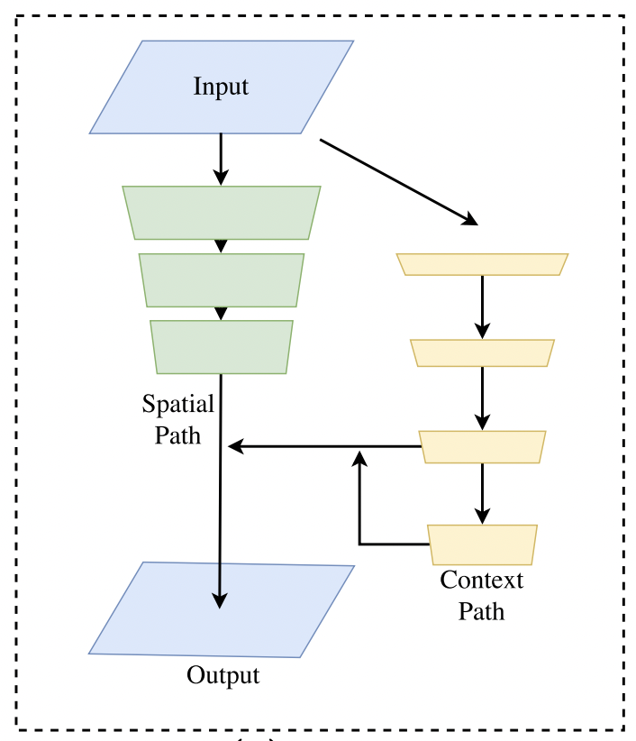
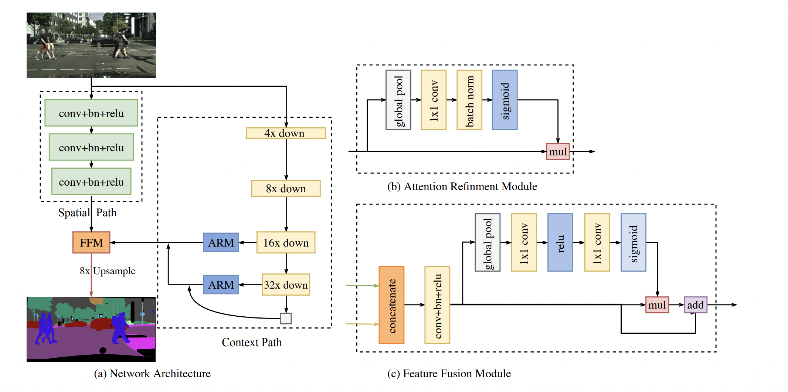
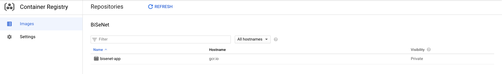
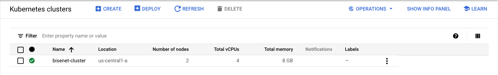
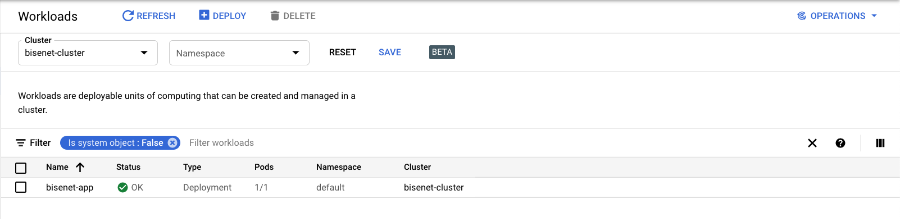
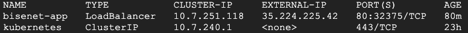
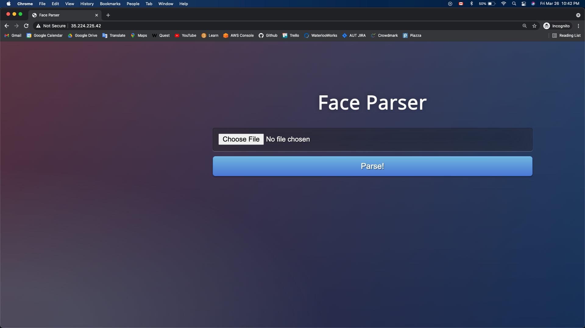
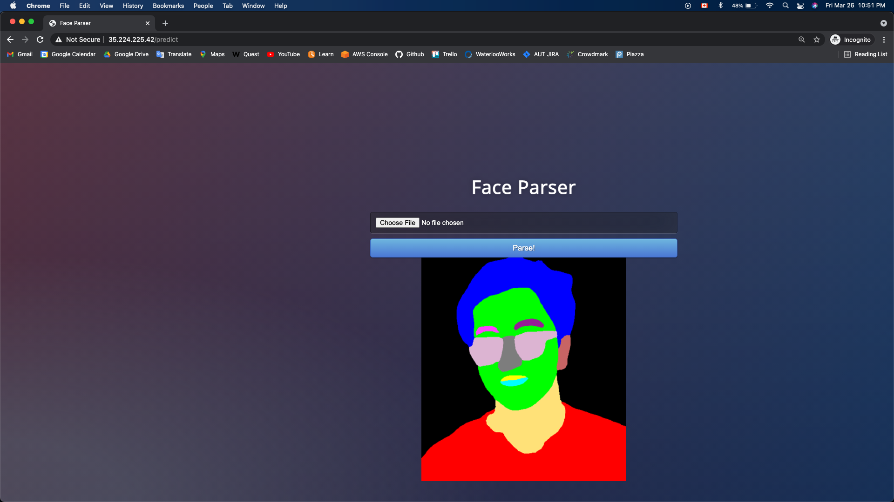

# BiSeNet-app
A face semantic segmentation Flask app deployed in a docker container on GCP Container Registry and a Kubernetes Engine cluster.

## Purpose
This app is built to parse an image that contains a human face to a labeled mask of the face. The face is segmented into multiple classes, labelled by colours.

| Input | Output |
| ------------- | ------------- |
|   | |

## Tools
* The app is built using Flask. The semantic segmentation model is written in PyTorch. For package details, refer to `requirements.txt`.
* The app is hosted on Google Cloud Platform (GCP). The docker image is pushed on to __*Container Registry*__, and then the app service is deployed and exposed in a Kubernetes cluster on __*Kubernetes Engine*__ .

## Computer Vision model
The image segmentation model is defined in a 2018 paper [*BiSeNet: Bilateral Segmentation Network for Real-time Semantic Segmentation*](https://arxiv.org/abs/1808.00897) by Changqian Yu et al. BiSeNet, which is the short form of Bilateral Segmentation Network, contains both Spatial Path(SP) and Context Path(CP) to counter loss of spatial information and shrinkage of receptive field. SP consists three convolutional layers to obtain the feature map. CP consists of an Xception network, followed by a global average pooling layer. A specially-designed Feature Fusion Module (FFM) and Attention Refinement Module (ARM) are also introduced in the paper to enhance overall sementic segmentation accuracy. For details, refer to the official paper.

| General Structure | Detailed Illustration |
| ------------- | ------------- |
|   | |

## Deployment Details
The app is deployed on GCP Kubernetes Engine. The cluster is configured to have 2 nodes, on 4 vCPUs in *us-central1-a*, with 8GB memory. The inference time on the provided test inference image is around 2 seconds. Currently the app is running at http://35.224.225.42/ , which will soon be (or, more like, has already been) shut down for resource conservation.

To deploy this app, follow the procedure below in a GCP console terminal:
* Clone repository: `git clone https://github.com/shawnhan108/BiSeNet-app.git`.
* Set project ID: `export PROJECT_ID=bisenet`.
* Build docker image: `docker build -t gcr.io/bisenet/bisenet-app:v1 .`.
* Authorize docker: `gcloud auth configure-docker`.
* Push docker image to Container Registry: `docker push gcr.io/bisenet/bisenet-app:v1`.
* Set computing region: `gcloud config set compute/zone us-central1-a`.
* Create a Kubernetes Engine cluster: `gcloud container clusters create bisenet-cluster --num-nodes=2`.
* Create a Kubernetes deployment of the app: `kubectl create deployment bisenet-app --image=gcr.io/bisenet/bisenet-app:v1`.
* Expose the app with a Load Balancer service: `kubectl expose deployment bisenet-app --type=LoadBalancer --port 80 --target-port 8080`.
* Go to the browser and test the app: `http://[EXTERNAL-IP]`, where EXTERNAL-IP can be obtained using `kubectl get service`.

| App Landing | Prediction Output |
| ------------- | ------------- |
|   | |

## References and Acknowledgements
* Moez Ali's *towards data science* tutorial [*Deploy Machine Learning Pipeline on Google Kubernetes Engine*](https://towardsdatascience.com/deploy-machine-learning-model-on-google-kubernetes-engine-94daac85108b), as well as its [affiliated repo](https://github.com/pycaret/pycaret-deployment-google).
* Changqian Yu et al.'s 2018 paper [*BiSeNet: Bilateral Segmentation Network for Real-time Semantic Segmentation*](https://arxiv.org/abs/1808.00897), and its [affiliated repo](https://github.com/agermanidis/face-parsing.PyTorch) by Anastasis Germanidis.
